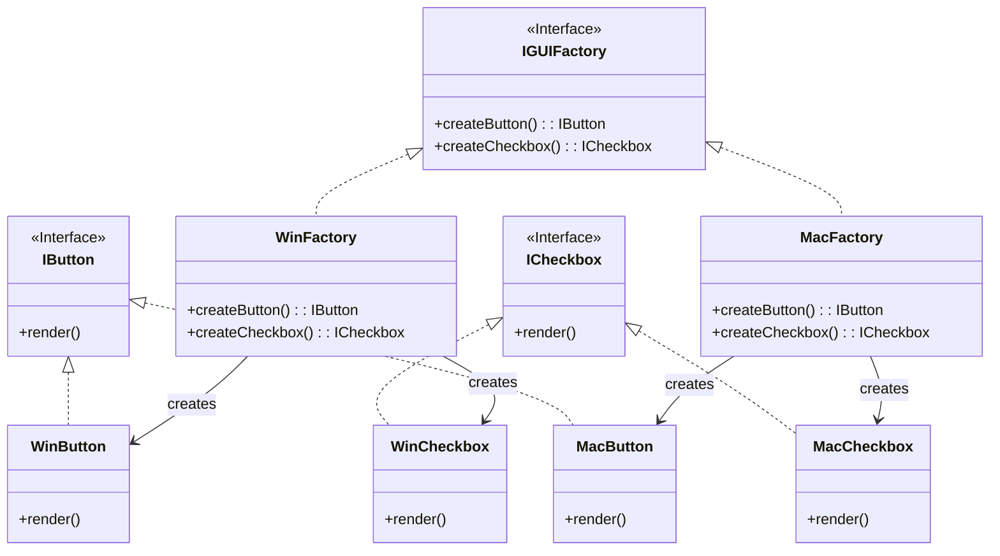

# Abstract Factory

Abstract Factory provides an interface for creating families of related or dependent objects without specifying their concrete classes.

## Problem

When you need to create objects that belong to a family (e.g., UI widgets for different platforms), you want to ensure that products from the same family are used together. Direct instantiation leads to tight coupling and makes switching families difficult.

## Description

The Abstract Factory pattern defines an interface for creating related objects (factories), and concrete factories implement this interface to produce objects from a specific family.

### Core Class Diagram

## When to Use

- When you need to create families of related objects
- When products from the same family must be used together
- To enforce consistency among products

## Benefits

- **Encapsulation**: Creation logic for families of products is encapsulated
- **Consistency**: Ensures products from the same family are used together
- **Flexibility**: Easy to introduce new families by adding new factories
- **Decoupling**: Client code is decoupled from concrete classes
