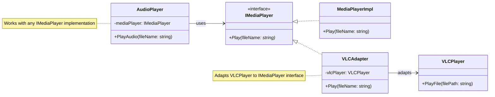

# Adapter

Structural pattern - allows objects with incompatible interfaces to collaborate by providing a wrapper that adapts one interface to another

## Problem

You have a class with a useful interface, but it doesn't match the interface that your code expects. For example:

```csharp
// Your existing code expects this interface
interface IMediaPlayer 
{
    void Play(string fileName);
}

// But you have this incompatible class from a third-party library
class VLCPlayer 
{
    public void PlayFile(string filePath) { }
}
```

Problems with this mismatch:
- Direct incompatibility - VLCPlayer doesn't implement IMediaPlayer
- Code expects specific interface - changing client code is not viable
- Integration is difficult - cannot use VLCPlayer where IMediaPlayer is expected

## Description

The Adapter pattern (also known as Wrapper) converts the interface of a class into another interface that clients expect. 
An adapter lets classes work together that couldn't otherwise because of incompatible interfaces.

There are two main approaches:
- **Class Adapter**: Uses inheritance to adapt the interface
- **Object Adapter**: Uses composition to wrap the incompatible object

### Core Class Diagram



## Real-World Example

### Before Adapter

Without the adapter, the code would need type checking and special handling:

```csharp
// Not flexible - code is coupled to specific implementations
if (player is VLCPlayer vlcPlayer)
{
    vlcPlayer.PlayFile(file);
}
else if (player is WindowsMediaPlayer wmp)
{
    wmp.OpenFile(file);
}
```

### With Adapter

```csharp
// Client code - simple and clean
IMediaPlayer player = new VLCAdapter(new VLCPlayer());
player.Play("movie.mp4");

// Different adapter for different implementation
IMediaPlayer player2 = new WindowsMediaAdapter(new WindowsMediaPlayer());
player2.Play("song.mp3");
```

## When to Use

- You want to use a third-party class or library but its interface doesn't match your needs
- You want to reuse a class but its interface is incompatible with the rest of the code
- You need multiple classes with incompatible interfaces to work together
- You want to create a reusable class that cooperates with unrelated or unforeseen classes
- You need to adapt legacy code to work with modern interfaces

## Benefits

- **Single Responsibility Principle**: Separates interface translation from business logic
- **Open/Closed Principle**: New adapters can be added without modifying existing code
- **Loose coupling**: Client code depends on abstract interfaces, not concrete implementations
- **Flexibility**: Objects with incompatible interfaces can work together
- **Reusability**: Adapters allow reuse of incompatible classes

## Drawbacks

- Adds complexity - introduces new classes and objects
- Additional runtime cost - wrapper adds a layer of indirection

## Related Patterns

- **Bridge**: Similar structure but different intent - Bridge separates abstraction from implementation, Adapter makes incompatible interfaces work together
- **Decorator**: Both use composition but Decorator adds functionality while Adapter changes interface
- **Facade**: Provides simplified interface to complex system, but Adapter makes incompatible interfaces compatible

## References

- [Microsoft Docs - Adapter Pattern](https://learn.microsoft.com/en-us/dotnet/standard/design-patterns/adapter-pattern)
- [Refactoring.Guru - Adapter](https://refactoring.guru/design-patterns/adapter)
- [Design Patterns: Elements of Reusable Object-Oriented Software by Gang of Four](https://en.wikipedia.org/wiki/Design_Patterns)
