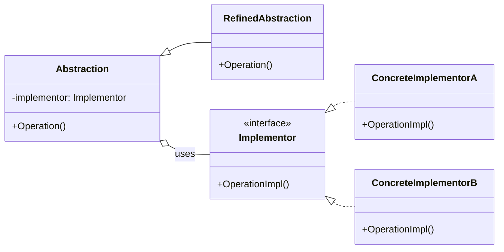

# Bridge

Bridge is a structural design pattern that decouples an abstraction from its implementation so that the two can vary independently.

## Problem

When you want to avoid a permanent binding between an abstraction and its implementation, especially when both can evolve independently. For example, you may have multiple UI controls (abstractions) and multiple rendering APIs (implementations).

## Description

The Bridge pattern splits a large class or closely related set of classes into two separate hierarchies—abstraction and implementation—which can be developed independently.

### Core Class Diagram

## When to Use

- When you want to separate abstraction from implementation
- When both abstraction and implementation should be extensible independently
- When changes in implementation should not affect client code

## Benefits

- **Decoupling**: Abstraction and implementation can be developed and extended independently
- **Flexibility**: Easier to switch implementations at runtime
- **Scalability**: Reduces class explosion when combining multiple abstractions and implementations
