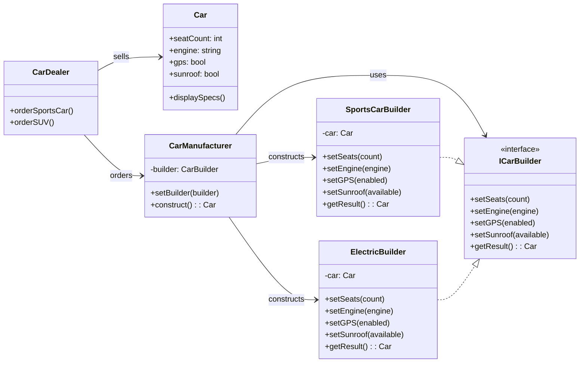

# Builder

Creational pattern - enables readable step-by-step creation of complex objects

## Problem

Sometimes there's a need to create a complex and sophisticated object. Creating such an object can be multi-stage and complicated.
A good example here is creating objects for assertions in unit tests. The **Builder** design pattern comes to the rescue.
Instead of creating awkward multi-parameter constructors, you can use readable methods with well-written error handling.

## Description

The Builder pattern separates the construction of a complex object from its representation, allowing the same construction process to create different representations.

### Core Class Diagram

## When to Use

- When an object has many optional parameters or complex construction logic
- When you want to provide readable, fluent APIs for object creation
- When object construction must allow different representations
- To avoid telescoping constructor patterns (many constructor overloads)

## Benefits

- **Improved readability**: Step-by-step construction makes code self-documenting
- **Immutability support**: Build complex immutable objects step by step
- **Flexibility**: Different builders can create different representations
- **Separation of concerns**: Construction logic is separated from business logic

