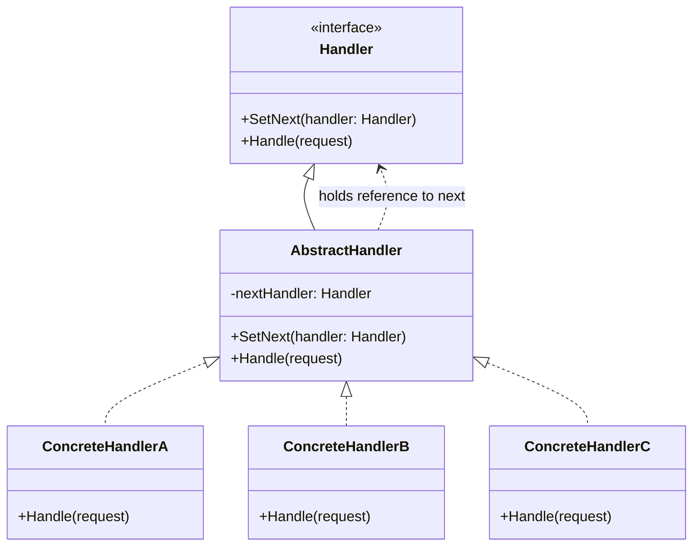

# Chain of Responsibility

Chain of Responsibility is a behavioral design pattern that lets you pass requests along a chain of handlers. Each handler decides either to process the request or to pass it to the next handler in the chain.

## Problem

When multiple objects may handle a request, but the handler isn't known until runtime, and more than one object might handle the request, client code becomes complex:

- Client must know which handler processes which request
- Multiple `if/else` checks for different handlers
- Hard to add new handlers without modifying existing code
- Request sender and receiver are tightly coupled

For example:
- Logging system: Different log levels (DEBUG, INFO, ERROR) handled by different loggers
- Approval workflow: Manager → Director → VP chain for expense approvals
- Event handling: UI events bubbling up through widget hierarchy

## Description

The Chain of Responsibility pattern creates a chain of handler objects. Each handler either processes the request or passes it to the next handler in the chain.

### Key Components:
- **Handler**: Base interface or abstract class declaring the processing method and next handler reference
- **Concrete Handler**: Concrete handlers that process requests or pass them to the next handler
- **Client**: Sends requests to the first handler in the chain

### Core Class Diagram



## When to Use

- When more than one object may handle a request and the handler isn't known a priori
- When you want to send a request to multiple handlers without specifying the receiver
- When the set of objects that can handle a request should be specified dynamically
- When you need to decouple the sender of a request from its receivers

## Benefits

- **Decouples sender and receiver**: Client doesn't know which handler processes the request
- **Adds flexibility**: Chain structure can be modified at runtime
- **Single Responsibility Principle**: Each handler has one responsibility
- **Open/Closed Principle**: New handlers can be added without modifying existing code

## Drawbacks

- Requests might not be handled if no handler in the chain processes it
- Debugging can be difficult due to chained processing
- Performance overhead from traversing the chain

## Real-World Example

### Logging System

```csharp
// Handler interface
abstract class Logger
{
    protected Logger _nextLogger;
    
    public Logger SetNext(Logger logger)
    {
        _nextLogger = logger;
        return logger;
    }
    
    public void Log(LogLevel level, string message)
    {
        if (CanHandle(level))
        {
            WriteMessage(message);
        }
        
        if (_nextLogger != null)
        {
            _nextLogger.Log(level, message);
        }
    }
    
    protected virtual bool CanHandle(LogLevel level) => false;
    protected virtual void WriteMessage(string message) { }
}

// Concrete handlers
class DebugLogger : Logger
{
    protected override bool CanHandle(LogLevel level) => level == LogLevel.Debug;
    
    protected override void WriteMessage(string message)
    {
        Console.WriteLine($"[DEBUG]: {message}");
    }
}

class InfoLogger : Logger
{
    protected override bool CanHandle(LogLevel level) => level == LogLevel.Info;
    
    protected override void WriteMessage(string message)
    {
        Console.WriteLine($"[INFO]: {message}");
    }
}

class ErrorLogger : Logger
{
    protected override bool CanHandle(LogLevel level) => level == LogLevel.Error;
    
    protected override void WriteMessage(string message)
    {
        Console.WriteLine($"[ERROR]: {message}");
    }
}

// Usage
var loggerChain = new DebugLogger();
loggerChain
    .SetNext(new InfoLogger())
    .SetNext(new ErrorLogger());

loggerChain.Log(LogLevel.Debug, "Debug message");
loggerChain.Log(LogLevel.Info, "Info message");
loggerChain.Log(LogLevel.Error, "Error message");

// Output:
// [DEBUG]: Debug message
// [INFO]: Info message
// [ERROR]: Error message
```

## Related Patterns

- **Command**: Can use Chain of Responsibility to handle commands
- **Composite**: Handlers in Chain of Responsibility can be structured as a composite
- **Decorator**: Chain of Responsibility can be seen as a sequence of decorators

## References

- [Microsoft Docs - Chain of Responsibility Pattern](https://learn.microsoft.com/en-us/dotnet/standard/design-patterns/chain-of-responsibility-pattern)
- [Refactoring.Guru - Chain of Responsibility](https://refactoring.guru/design-patterns/chain-of-responsibility)
- [Design Patterns: Elements of Reusable Object-Oriented Software by Gang of Four](https://en.wikipedia.org/wiki/Design_Patterns)
