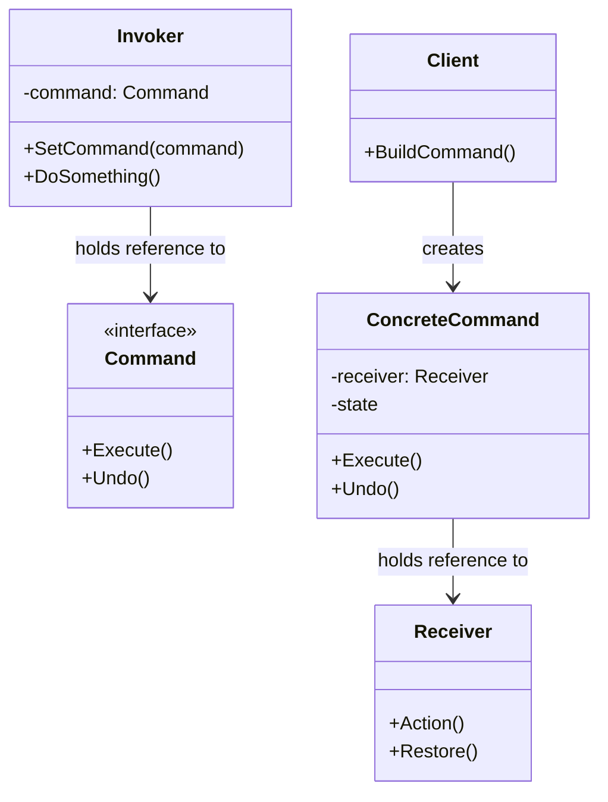

# Command

Command is a behavioral design pattern that turns a request into a stand-alone object that contains all information about the request. This transformation lets you parameterize methods with different requests, delay or queue request execution, and support undoable operations.

## Problem

When you need to issue requests to objects without knowing the requested operation or receiver, tight coupling becomes problematic:
- Methods are hard-coded to specific receivers and operations
- Cannot easily queue, log, or delay request execution
- Undo/redo functionality requires complex tracking mechanisms
- Cannot separate request senders from receivers

For example:
- GUI buttons that need to trigger different actions
- Macro recording: sequence of operations that can be replayed
- Transaction systems: operations that can be committed or rolled back
- Remote control with multiple buttons for different devices

## Description

The Command pattern encapsulates a request as an object, thereby letting you parameterize clients with queues, logs, and operations. The command object holds all information needed to execute the request, including method name, receiver, and parameters.

### Key Components:
- **Command**: Abstract interface declaring execution method (Execute/Undo)
- **Concrete Command**: Implements execution by delegating to receiver
- **Receiver**: Object performing the actual work
- **Invoker**: Object that triggers commands
- **Client**: Creates commands and configures them with receivers

### Core Class Diagram



## When to Use

- When you need to parameterize objects with operations
- When you need to queue, delay, or order request execution
- When you want to support undoable operations
- When you need to track command history for logging or rollback
- When you want to separate request senders from receivers
- For implementing macros or transactional operations

## Benefits

- **Decoupling**: Invoker is decoupled from receiver objects
- **Single Responsibility Principle**: Clean separation between invoker and receiver
- **Open/Closed Principle**: New commands can be added without changing existing code
- **Undo/Redo support**: Commands can implement undo functionality
- **Queuing**: Commands can be stored and executed later
- **Logging**: Command history can be recorded for audit trails

## Drawbacks

- Increased complexity: Many additional classes for simple operations
- Memory overhead: Command objects store state for potential undo
- Potential performance impact: Indirection through command objects

## Real-World Example

### Macro Recorder with Undo Support

```csharp
// Receiver
class Light
{
    public string Location { get; }
    
    public Light(string location)
    {
        Location = location;
    }
    
    public void TurnOn()
    {
        Console.WriteLine($"{Location} light is ON");
    }
    
    public void TurnOff()
    {
        Console.WriteLine($"{Location} light is OFF");
    }
}

// Command interface
interface ICommand
{
    void Execute();
    void Undo();
}

// Concrete commands
class LightOnCommand : ICommand
{
    private readonly Light _light;
    
    public LightOnCommand(Light light)
    {
        _light = light;
    }
    
    public void Execute()
    {
        _light.TurnOn();
    }
    
    public void Undo()
    {
        _light.TurnOff();
    }
}

class LightOffCommand : ICommand
{
    private readonly Light _light;
    
    public LightOffCommand(Light light)
    {
        _light = light;
    }
    
    public void Execute()
    {
        _light.TurnOff();
    }
    
    public void Undo()
    {
        _light.TurnOn();
    }
}

// Invoker
class RemoteControl
{
    private ICommand _command;
    
    public void SetCommand(ICommand command)
    {
        _command = command;
    }
    
    public void PressButton()
    {
        _command.Execute();
    }
    
    public void PressUndo()
    {
        _command.Undo();
    }
}

// Usage
var hallwayLight = new Light("Hallway");
var lightOn = new LightOnCommand(hallwayLight);

var remote = new RemoteControl();
remote.SetCommand(lightOn);

remote.PressButton();   // Hallway light is ON
remote.PressUndo();     // Hallway light is OFF
```

## Related Patterns

- **Adapter**: Both wrap objects but Adapter changes interface while Command preserves it
- **Chain of Responsibility**: Commands can be chained for complex operations
- **Memento**: Used with Command for storing state for undo functionality
- **Macro**: Command pattern is the foundation for macro recording patterns

## References

- [Microsoft Docs - Command Pattern](https://learn.microsoft.com/en-us/dotnet/standard/design-patterns/command-pattern)
- [Refactoring.Guru - Command](https://refactoring.guru/design-patterns/command)
- [Design Patterns: Elements of Reusable Object-Oriented Software by Gang of Four](https://en.wikipedia.org/wiki/Design_Patterns)
