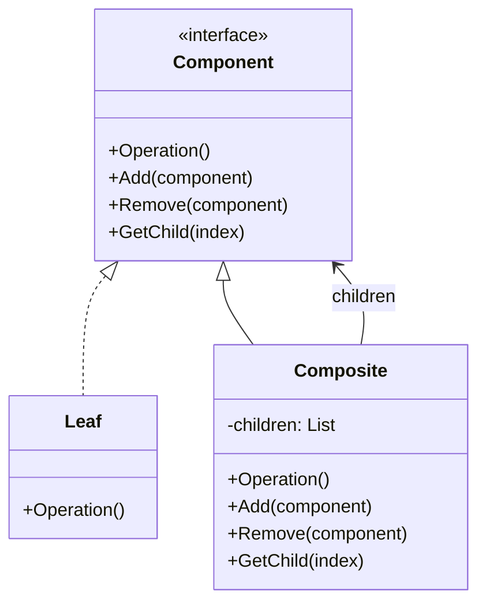

# Composite

Composite is a structural design pattern that lets you compose objects into tree structures to represent part-whole hierarchies. It allows clients to treat individual objects and compositions of objects uniformly.

## Problem

When you need to represent a part-whole hierarchy (e.g., file system, UI components, organizational charts), dealing with individual objects and containers separately makes client code complex and inconsistent.

For example:
- Files and folders: files are leaf nodes, folders contain files/folders
- UI components: buttons are leaves, panels contain buttons/other panels

Without Composite, client code must distinguish between single objects and collections.

## Description

The Composite pattern introduces two types of components:
- **Component**: Base interface or abstract class declaring common operations
- **Leaf**: Individual objects with no children
- **Composite**: Container objects that manage child components

All operations are delegated to children for composites, while leaves implement the operation directly.

### Core Class Diagram

## When to Use

- When you need to represent part-whole hierarchies
- When clients should treat individual and composite objects uniformly
- When the hierarchy can be represented as a tree structure

## Benefits

- **Simplifies client code**: Uniform treatment of single and nested objects
- **Encourages separation of concerns**: Leaf and composite logic is separated
- **Enables recursion naturally**: Operations propagate through the tree
- **Follows Open/Closed principle**: Easy to add new component types
