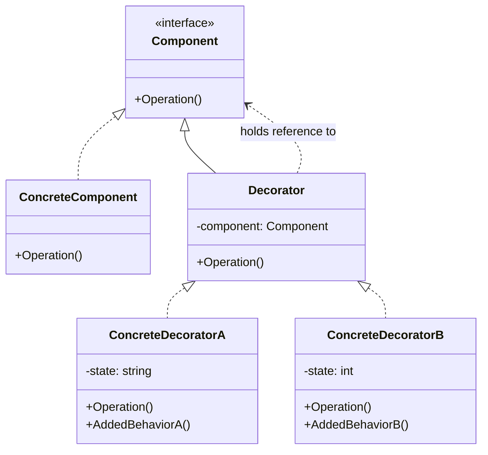

# Decorator

Decorator is a structural design pattern that lets you attach new behaviors to objects by placing them inside special wrapper objects that implement the same interface as the original object.

## Problem

When you need to add responsibilities to an object dynamically and flexibly, inheritance becomes inflexible:
- Adding behavior at compile time affects all instances of the class
- Cannot add behavior to individual objects selectively
- Deep inheritance hierarchies become complex and hard to maintain

For example:
- Coffee shop system: Basic coffee vs. adding milk, sugar, whipped cream
- Text formatting: Plain text vs. bold, italic, underline combinations
- Stream processing: File stream vs. buffered, encrypted, compressed variants

Without Decorator, you'd need many subclasses for every combination of features.

## Description

The Decorator pattern wraps an object in a special wrapper class that implements the same interface and delegates to the wrapped object while adding new behavior.

### Key Components:
- **Component**: Base interface or abstract class with core functionality
- **Concrete Component**: Original object implementing core behavior
- **Decorator**: Abstract wrapper class holding a component reference
- **Concrete Decorator**: Concrete wrapper classes adding specific behaviors

### Core Class Diagram



## When to Use

- When you need to add responsibilities to objects dynamically and transparently
- When extension by subclassing is impractical (too many combinations)
- When you want to keep the core functionality separate from optional features
- When you need to apply multiple transformations to an object

## Benefits

- **Flexibility**: Add or remove behavior at runtime
- **Single Responsibility Principle**: Each decorator has one responsibility
- **Open/Closed Principle**: New decorators can be added without modifying existing code
- **Composition over inheritance**: Uses composition for dynamic behavior addition
- **Reusability**: Decorators can wrap any component implementing the interface

## Drawbacks

- Complex code: Many small classes can be hard to understand
- Initialization complexity: Object creation with multiple wrappers requires setup
- Potential performance overhead: Multiple method calls through decorators

## Real-World Example

### Coffee Shop System

```csharp
// Component interface
interface IBeverage
{
    string GetDescription();
    double Cost();
}

// Concrete component
class SimpleCoffee : IBeverage
{
    public string GetDescription() => "Simple coffee";
    public double Cost() => 2.0;
}

// Decorator base class
abstract class CoffeeDecorator : IBeverage
{
    protected readonly IBeverage _beverage;
    
    protected CoffeeDecorator(IBeverage beverage)
    {
        _beverage = beverage;
    }
    
    public virtual string GetDescription() => _beverage.GetDescription();
    public virtual double Cost() => _beverage.Cost();
}

// Concrete decorators
class MilkDecorator : CoffeeDecorator
{
    public MilkDecorator(IBeverage beverage) : base(beverage) { }
    
    public override string GetDescription() => base.GetDescription() + ", milk";
    public override double Cost() => base.Cost() + 0.5;
}

class WhippedCreamDecorator : CoffeeDecorator
{
    public WhippedCreamDecorator(IBeverage beverage) : base(beverage) { }
    
    public override string GetDescription() => base.GetDescription() + ", whipped cream";
    public override double Cost() => base.Cost() + 0.7;
}

// Usage
IBeverage coffee = new SimpleCoffee();
coffee = new MilkDecorator(coffee);
coffee = new WhippedCreamDecorator(coffee);

Console.WriteLine($"{coffee.GetDescription()} costs ${coffee.Cost()}");
// Output: "Simple coffee, milk, whipped cream" costs $3.2
```

## Related Patterns

- **Adapter**: Both use composition but Adapter changes interface while Decorator preserves it
- **Composite**: Decorator can be seen as a simplified Composite with only one component
- **Strategy**: Strategy changes behavior via composition, Decorator adds behavior via wrapping

## References

- [Microsoft Docs - Decorator Pattern](https://learn.microsoft.com/en-us/dotnet/standard/design-patterns/decorator-pattern)
- [Refactoring.Guru - Decorator](https://refactoring.guru/design-patterns/decorator)
- [Design Patterns: Elements of Reusable Object-Oriented Software by Gang of Four](https://en.wikipedia.org/wiki/Design_Patterns)
