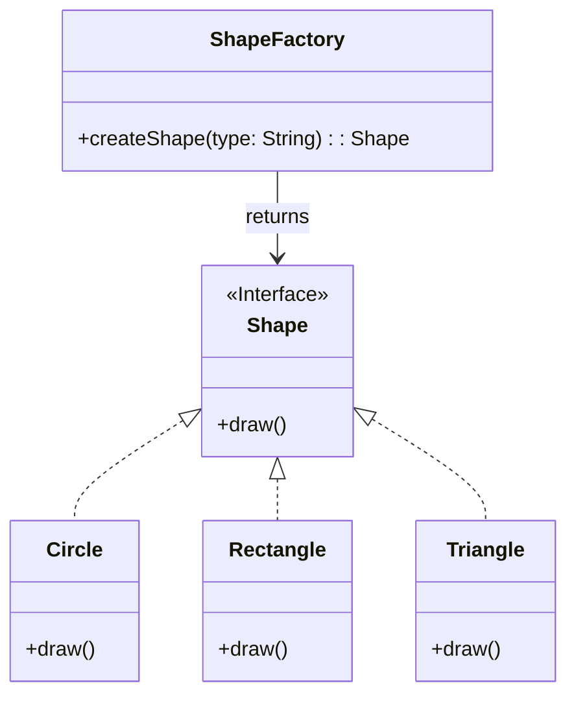

# Factory

Factory resolves the problem of object creation without coupling code to specific classes.

## Problem

Often code creates objects directly using `new`:

```c#
Shape shape;

if (type.equals("circle")) {
    shape = new Circle();
} else if (type.equals("rectangle")) {
    shape = new Rectangle();
}
```

Problems with this approach:
- Strong coupling to classes - code knows specific classes (Circle, Rectangle)
- Difficult to extend - adding a new shape requires modifying existing code
- Violates Open/Closed principle - code is not closed for modifications

## Description

Factory is used to create the appropriate type of object without revealing details of its creation.
The factory class decides which object to create, the client doesn't use `new()` directly, but uses a static method `CreateSomething()`.

```
Shape shape = ShapeFactory.createShape("circle");
shape.draw();
```

Factory in this case can return for example:
- Circle
- Rectangle
- Triangle

In contrast to the **Builder** design pattern, **Factory** doesn't focus on how to build the object (which components to assemble), but rather *what type of object* to create.

### Core Class Diagram




## Advantages:

- Hides object creation logic
- Easy to extend with new types

## When to use:

- Multiple classes implement the same interface
- The decision about object type is made at runtime