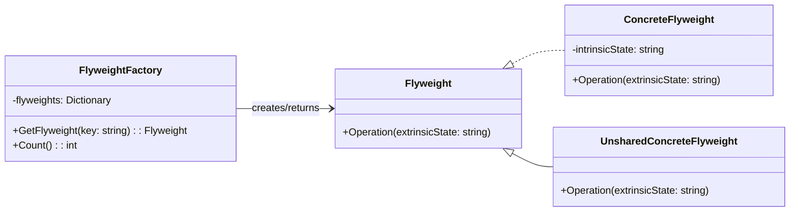

# Flyweight

Flyweight is a structural design pattern that lets you fit more objects into available memory by sharing common parts of state between multiple objects instead of keeping all data in each object.

## Problem

When your application creates many similar objects, memory consumption becomes a problem. For example, displaying thousands of text characters or game entities with shared properties.

For example:
- Text editor: thousands of character objects, each with font, size, color
- Game: thousands of enemy units with shared texture and behavior
- Each object holding the same data wastes memory

## Description

The Flyweight pattern splits an object into two parts:
- **Intrinsic State**: Shared, immutable data stored in the flyweight object (font, texture)
- **Extrinsic State**: Unique, context-dependent data stored externally (position, color variation)

A flyweight factory manages a pool of shared objects and returns existing instances when possible.

### Core Class Diagram



## When to Use

- Application creates many similar objects
- Memory usage is high due to object duplication
- Object state can be divided into intrinsic (shared) and extrinsic (unique) parts
- Application doesn't depend on object identity

## Benefits

- **Reduces memory footprint**: Shared objects consume less memory
- **Improves performance**: Fewer objects to create and garbage collect
- **Centralizes shared data**: Easier to manage common properties

## Drawbacks

- **Complexity**: Requires separating intrinsic and extrinsic state
- **Runtime cost**: Lookups in flyweight pool add overhead
- **Not suitable for all scenarios**: Only beneficial with many similar objects

## Real-World Example

### Text Formatting

```csharp
// Intrinsic state: shared formatting properties
class TextStyle
{
    public string Font { get; }
    public int Size { get; }
    public Color Color { get; }
    
    public TextStyle(string font, int size, Color color)
    {
        Font = font;
        Size = size;
        Color = color;
    }
}

// Flyweight factory manages shared styles
class TextStyleFactory
{
    private Dictionary<string, TextStyle> _styles = new();
    
    public TextStyle GetStyle(string fontFamily, int fontSize, string color)
    {
        var key = $"{fontFamily}-{fontSize}-{color}";
        
        if (!_styles.ContainsKey(key))
        {
            _styles[key] = new TextStyle(fontFamily, fontSize, Color.FromName(color));
        }
        
        return _styles[key];
    }
}

// Usage
var factory = new TextStyleFactory();
var style1 = factory.GetStyle("Arial", 12, "Black");
var style2 = factory.GetStyle("Arial", 12, "Black"); // Returns same instance

// Extrinsic state: unique character properties
class CharData
{
    public char Symbol { get; set; }
    public int Position { get; set; }
}
```

## Related Patterns

- **Composite**: Flyweight can be used with Composite to share leaf nodes in a tree
- **Singleton**: Flyweight objects are often managed as singletons via the factory
- **Decorator**: Both use wrapping, but Decorator adds functionality while Flyweight shares state

## References

- [Microsoft Docs - Flyweight Pattern](https://learn.microsoft.com/en-us/dotnet/standard/design-patterns/flyweight-pattern)
- [Refactoring.Guru - Flyweight](https://refactoring.guru/design-patterns/flyweight)
- [Design Patterns: Elements of Reusable Object-Oriented Software by Gang of Four](https://en.wikipedia.org/wiki/Design_Patterns)
