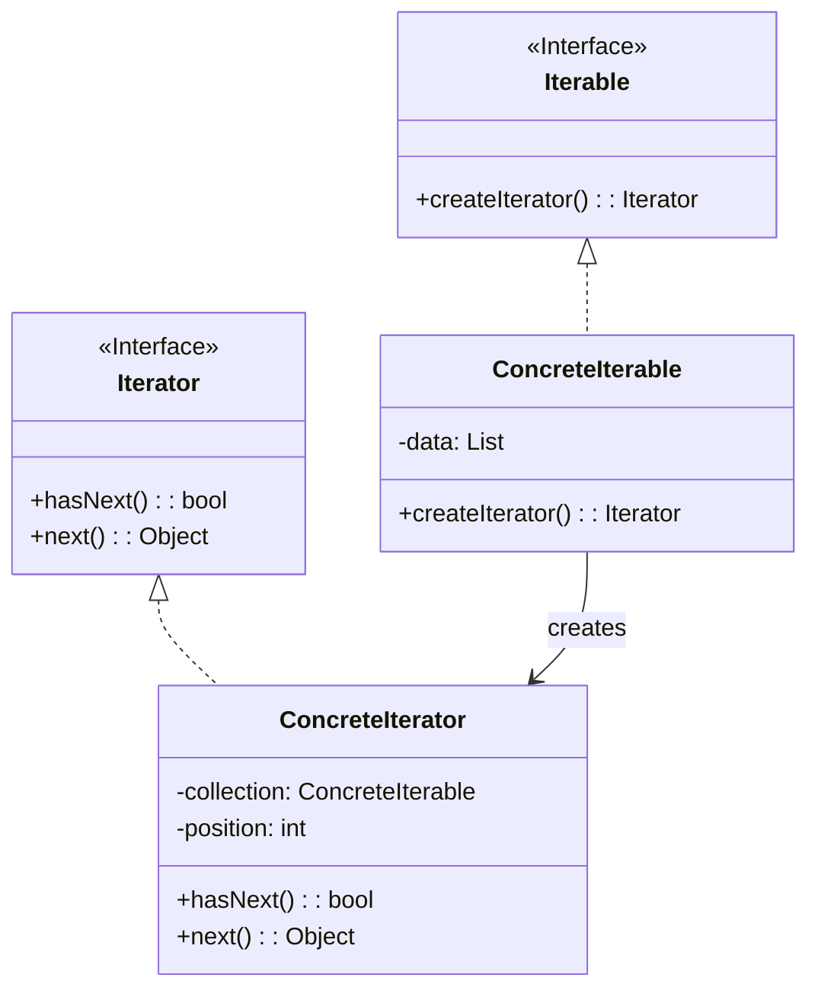

# Iterator

Iterator is a behavioral design pattern that provides a way to access elements of a collection sequentially without exposing its underlying representation.

## Problem

When working with collections (arrays, lists, trees, etc.), you often need to traverse them to process or display their elements. Directly accessing collection elements exposes the internal structure and makes the code dependent on specific implementations.

## Description

The Iterator pattern extracts the traversal behavior from the collection into a separate iterator class. This creates a common interface for traversing different types of collections and allows multiple iteration strategies coexisting with the same collection.

### Core Class Diagram

## When to Use

- When you need to access collection elements without exposing its internal structure
- When you want to support multiple traversal methods for the same collection
- When you need a common interface for traversing different types of collections
- To simplify client code that processes collections

## Benefits

- **Encapsulation**: Collection's internal representation is hidden from clients
- **Multiple Iterations**: Multiple iterators can traverse the same collection independently
- **Single Responsibility Principle**: Collection handles data management, iterator handles traversal
- **Open/Closed Principle**: Easy to introduce new iteration strategies without modifying collection code
