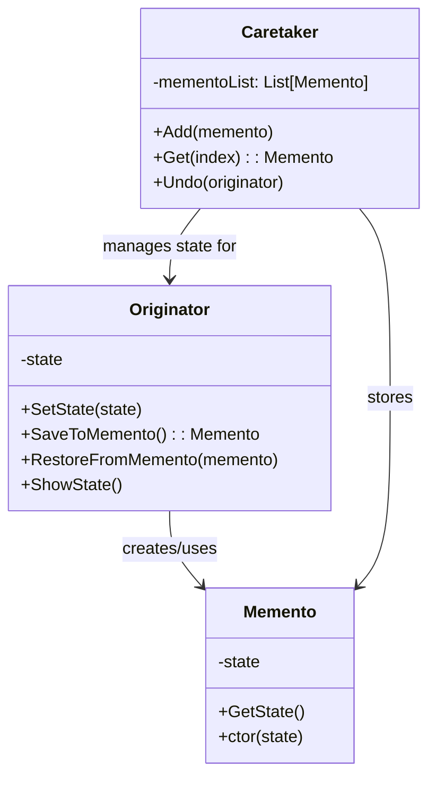

# Memento

Memento is a behavioral design pattern that lets you save and restore the previous state of an object without revealing the details of its implementation.

## Problem

When you need to implement undo/rollback functionality or snapshot capabilities, directly exposing an object's internal state violates encapsulation:
- Exposing private fields breaks encapsulation
- Saving state externally requires complex tracking mechanisms
- Object must manage its own history, violating Single Responsibility Principle
- Different objects have different state structures, making uniform backup difficult

For example:
- Text editor with undo/redo functionality
- Game save/load system
- Database transaction rollback
- Form with cancel button that restores original values

## Description

The Memento pattern captures an object's internal state without violating encapsulation, so the object can be restored to this state later. The saved state is stored in a special memento object that only the originator can access.

### Key Components:
- **Originator**: Object whose state needs to be saved/restored
- **Memento**: Immutable object storing the state snapshot
- **Caretaker**: Manages mementos, decides when to save/restore
- **Storage**: Repository for keeping multiple mementos

### Core Class Diagram



## When to Use

- When you need undo/redo functionality
- When you want to implement snapshots or versioning
- When direct access to object's internal state would break encapsulation
- When you need to restore object to previous state without exposing implementation details
- For implementing checkpoint systems in games or applications

## Benefits

- **Encapsulation preserved**: Internal state remains private
- **Simplified Originator**: Originator doesn't need to track its own history
- **Single Responsibility Principle**: Caretaker manages history, Originator focuses on business logic
- **Simple implementation**: State is stored as a simple object snapshot
- **Flexible rollback**: Can maintain multiple historical states

## Drawbacks

- Memory overhead: Each memento stores complete state copy
- Performance impact: Large state objects can be expensive to clone
- Caretaker must manage memento lifecycle to avoid memory leaks
- May require deep copying for complex state structures

## Real-World Example

### Text Editor with Undo Functionality

```csharp
// Memento - holds state (immutable)
class TextMemento
{
    public string Content { get; }
    public DateTime Timestamp { get; }

    public TextMemento(string content, DateTime timestamp)
    {
        Content = content;
        Timestamp = timestamp;
    }
}

// Originator - the object whose state is managed
class TextEditor
{
    private string _content;

    public string Content
    {
        get => _content ?? "";
        set => _content = value;
    }

    public void Type(string text)
    {
        _content += text;
    }

    public TextMemento Save()
    {
        return new TextMemento(_content, DateTime.Now);
    }

    public void Restore(TextMemento memento)
    {
        _content = memento.Content;
    }

    public override string ToString() => $"Content: {_content}, Saved at: {DateTime.Now}";
}

// Caretaker - manages mementos
class History
{
    private readonly Stack<TextMemento> _mementos = new Stack<TextMemento>();

    public void Push(TextMemento memento)
    {
        _mementos.Push(memento);
    }

    public TextMemento Pop()
    {
        return _mementos.Pop();
    }

    public int Count => _mementos.Count;
}

// Usage
var editor = new TextEditor();
var history = new History();

editor.Type("Hello ");
history.Push(editor.Save());

editor.Type("world!");
history.Push(editor.Save());

Console.WriteLine($"Current: {editor}");

// Undo last change
editor.Restore(history.Pop());
Console.WriteLine($"After undo: {editor}");

// Undo again
editor.Restore(history.Pop());
Console.WriteLine($"After second undo: {editor}");
```

### Game Save System

```csharp
class GameStateMemento
{
    public int Level { get; }
    public int Score { get; }
    public List<string> Inventory { get; }

    public GameStateMemento(int level, int score, List<string> inventory)
    {
        Level = level;
        Score = score;
        Inventory = new List<string>(inventory);
    }
}

class GameSession
{
    private int _level;
    private int _score;
    private readonly List<string> _inventory = new List<string>();

    public void AdvanceLevel() => _level++;
    public void AddScore(int points) => _score += points;
    public void PickItem(string item) => _inventory.Add(item);

    public GameStateMemento Save()
    {
        return new GameStateMemento(_level, _score, _inventory);
    }

    public void Load(GameStateMemento memento)
    {
        _level = memento.Level;
        _score = memento.Score;
        _inventory.Clear();
        _inventory.AddRange(memento.Inventory);
    }
}

// Usage: Auto-save every 5 minutes
var game = new GameSession();
var history = new History();

// Save game periodically
history.Push(game.Save());
```

## Related Patterns

- **Command**: Commands can use Memento to store state before execution for undo functionality
- **Prototype**: Memento can use cloning to create state snapshots efficiently
- **Composite**: Caretaker can manage multiple mementos for complex object hierarchies

## References

- [Microsoft Docs - Memento Pattern](https://learn.microsoft.com/en-us/dotnet/standard/design-patterns/memento-pattern)
- [Refactoring.Guru - Memento](https://refactoring.guru/design-patterns/memento)
- [Design Patterns: Elements of reusable Object-Oriented Software by Gang of Four](https://en.wikipedia.org/wiki/Design_Patterns)
