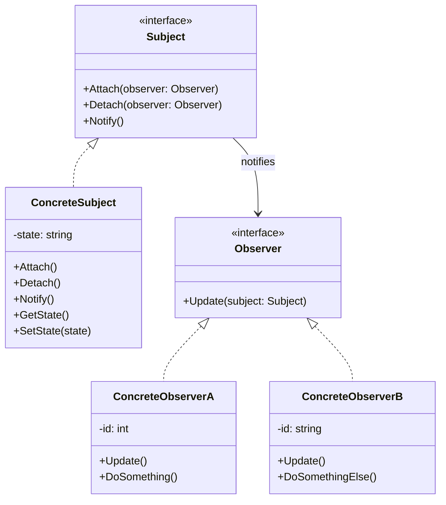

# Observer

Observer is a behavioral design pattern that lets you define a subscription mechanism to notify multiple objects about any events that happen to the object they're observing.

## Problem

When an object needs to automatically inform other objects about changes in its state without creating tight coupling:
- Changes in one object may require changing other objects
- Number of observer objects is unknown or can change dynamically
- Objects should be able to subscribe/unsubscribe from notifications at any time

For example:
- Weather station: Multiple displays need updates when weather data changes
- News publisher: Subscribers receive new articles when published
- GUI event handling: UI components react to user actions

Without Observer, you'd need polling (inefficient) or tight coupling (inflexible).

## Description

The Observer pattern defines a one-to-many dependency between objects so that when one object changes state, all its dependents are notified and updated automatically.

### Key Components:
- **Subject**: The observed object that maintains state and manages observers
- **Concrete Subject**: Concrete implementation of subject with specific state
- **Observer**: Interface or base class for all observer objects
- **Concrete Observer**: Concrete implementations that react to subject updates

### Core Class Diagram



## When to Use

- When changes to one object require changing others (one-to-many dependency)
- When the number of objects that need to be notified is unknown or dynamic
- When objects should be able to subscribe/unsubscribe from events at runtime
- When you want to avoid tight coupling between sender and receiver objects

## Benefits

- **Loose Coupling**: Subject doesn't need to know concrete observer classes
- **Runtime flexibility**: Can add/remove observers dynamically
- **Reusability**: Observers can be reused with different subjects
- **Open/Closed Principle**: New observers can be added without modifying subject
- **Broadcast communication**: Notifies all subscribers automatically

## Drawbacks

- Performance overhead: Notifying many observers sequentially
- Memory leaks: If subscriptions aren't properly removed
- Unpredictable order: Observers may not know which other observers were notified first
- Complexity: More classes and relationships to manage

## Real-World Example

### News Subscription System

```csharp
// Observer interface
interface IObserver
{
    void Update(string articleTitle);
}

// Concrete Observer
class Subscriber : IObserver
{
    private readonly string _name;
    
    public Subscriber(string name)
    {
        _name = name;
    }
    
    public void Update(string articleTitle)
    {
        Console.WriteLine($"{_name} received: {articleTitle}");
    }
}

// Subject interface
interface INewsPublisher
{
    void Attach(IObserver observer);
    void Detach(IObserver observer);
    void Notify();
    void PublishArticle(string title);
}

// Concrete Subject
class NewsAgency : INewsPublisher
{
    private readonly List<IObserver> _observers = new();
    private string _latestArticle;
    
    public void Attach(IObserver observer)
    {
        _observers.Add(observer);
        Console.WriteLine($"Subscriber {observer} attached");
    }
    
    public void Detach(IObserver observer)
    {
        _observers.Remove(observer);
        Console.WriteLine($"Subscriber {observer} detached");
    }
    
    public void Notify()
    {
        foreach (var observer in _observers)
        {
            observer.Update(_latestArticle);
        }
    }
    
    public void PublishArticle(string title)
    {
        _latestArticle = title;
        Console.WriteLine($"\nNewsAgency: Article published - {title}");
        Notify();
    }
}

// Usage
var agency = new NewsAgency();

var alice = new Subscriber("Alice");
var bob = new Subscriber("Bob");

agency.Attach(alice);
agency.Attach(bob);

agency.PublishArticle("New C# 12 Features");
// Output:
// Alice received: New C# 12 Features
// Bob received: New C# 12 Features

agency.Detach(bob);
agency.PublishArticle("Design Patterns Tutorial");
// Output:
// Alice received: Design Patterns Tutorial
```

## Related Patterns

- **Mediator**: Both handle communication but Mediator centralizes it while Observer distributes notifications
- **Command**: Can be combined with Observer for event queuing and macro recording
- **Singleton**: Subject is often implemented as a singleton for global access
- **Strategy**: Observers can use different strategies for handling updates

## References

- [Microsoft Docs - Observer Pattern](https://learn.microsoft.com/en-us/dotnet/standard/design-patterns/observer-pattern)
- [Refactoring.Guru - Observer](https://refactoring.guru/design-patterns/observer)
- [Design Patterns: Elements of Reusable Object-Oriented Software by Gang of Four](https://en.wikipedia.org/wiki/Design_Patterns)
