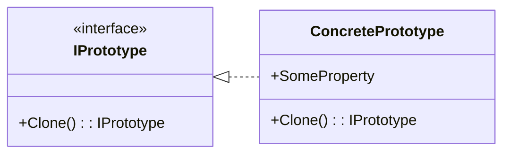

# Prototype

Prototype is a creational design pattern that allows cloning existing objects without depending on their concrete classes.

## Problem

When creating new objects is costly or complex, and you need many similar objects, instantiating them directly can be inefficient. The Prototype pattern enables copying existing objects, reducing the need for repetitive initialization and configuration.

## Description

The Prototype pattern defines an interface for cloning objects. Concrete classes implement this interface to return a copy of themselves. This allows clients to create new instances by copying a prototype, rather than constructing from scratch.

### Core Class Diagram

