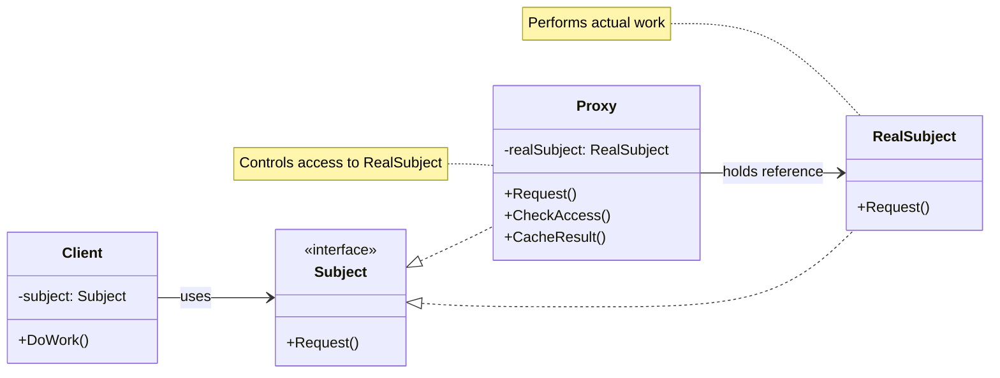

# Proxy

Structural pattern - provides a surrogate or placeholder for another object to control access to it

## Problem

You need to control access to an object, add functionality without modifying its code, or defer expensive operations. For example:

- **Remote proxy**: Object in a different address space (e.g., web service call)
- **Virtual proxy**: Expensive object created only when needed
- **Protection proxy**: Access control based on credentials
- **Logging proxy**: Add logging to method calls

Problems this solves:
- Direct access to real object is expensive or restricted
- Need to add behavior without modifying the original class
- Want to defer costly initialization until necessary

## Description

The Proxy pattern provides a surrogate or placeholder object that references the real subject object. The proxy controls access to the real object and can add additional functionality before or after forwarding requests.

### Key Roles:
- **Subject**: Interface defines the common interface for RealSubject and Proxy
- **RealSubject**: Actual object that does the work
- **Proxy**: Maintains reference to RealSubject, controls access, adds functionality

### Core Class Diagram



## Real-World Example

### Virtual Proxy (Lazy Initialization)

```csharp
// Subject interface
interface IImage
{
    void Display();
}

// RealSubject - expensive object
class RealImage : IImage
{
    private string _fileName;
    
    public RealImage(string fileName)
    {
        _fileName = fileName;
        LoadFromDisk();  // Expensive operation
    }
    
    private void LoadFromDisk()
    {
        Console.WriteLine($"Loading image: {_fileName}");
    }
    
    public void Display()
    {
        Console.WriteLine($"Displaying image: {_fileName}");
    }
}

// Proxy - controls access, defers initialization
class ImageProxy : IImage
{
    private string _fileName;
    private RealImage _realImage;
    
    public ImageProxy(string fileName)
    {
        _fileName = fileName;
    }
    
    public void Display()
    {
        if (_realImage == null)
        {
            _realImage = new RealImage(_fileName);  // Lazy initialization
        }
        
        CheckAccess();
        _realImage.Display();
    }
    
    private bool CheckAccess()
    {
        Console.WriteLine("Checking permissions...");
        return true;
    }
}

// Usage - image loaded only when Display() is called
IImage image = new ImageProxy("photo.jpg");
// No loading yet...
image.Display();  // Now it loads and displays
```

### Remote Proxy (Service Call)

```csharp
interface IDataService
{
    string GetData();
}

class RemoteDataService : IDataService
{
    public string GetData()
    {
        // Make expensive web service call
        return "Data from remote server";
    }
}

class DataServiceProxy : IDataService
{
    private RemoteDataService _service;
    private string _cachedData;
    
    public string GetData()
    {
        if (_service == null)
            _service = new RemoteDataService();
        
        // Add logging, caching, or error handling
        Console.WriteLine("Calling data service...");
        return _service.GetData();
    }
}
```

### Protection Proxy (Access Control)

```csharp
class User
{
    public string Role { get; set; }
}

class DatabaseProxy : IDatabase
{
    private User _user;
    private RealDatabase _database = new RealDatabase();
    
    public DatabaseProxy(User user)
    {
        _user = user;
    }
    
    public string ReadData()
    {
        if (_user.Role == "Admin")
            return _database.ReadData();
        
        throw new AccessDeniedException("Only admins can read data");
    }
}
```

## When to Use

- Need lazy initialization or virtual proxy (defer expensive object creation)
- Want to add access control or protection proxy
- Need logging, caching, or other cross-cutting concerns
- Working with remote objects (remote proxy)
- Want to implement smart pointers or reference counting
- Need to add functionality without modifying the original class

## Benefits

- **Single Responsibility Principle**: Separates proxy logic from business logic
- **Open/Closed Principle**: New proxy types can be added without changing existing code
- **Lazy initialization**: Expensive objects created only when needed
- **Access control**: Can enforce permissions before delegating to real object
- **Caching**: Proxy can cache results to avoid repeated expensive calls
- **Logging/monitoring**: Easy to add logging without modifying real object

## Drawbacks

- Added complexity - introduces additional layer of indirection
- Potential performance overhead - extra method calls through proxy
- Can make debugging more difficult due to increased layers

## Related Patterns

- **Decorator**: Both use composition but Decorator adds functionality transparently while Proxy controls access and may not be transparent
- **Facade**: Proxy controls single object, Facade provides simplified interface to complex subsystem
- **Adapter**: Adapter changes interface, Proxy preserves same interface
- **Singleton**: Proxy can ensure only one instance of expensive object is created

## References

- [Microsoft Docs - Proxy Pattern](https://learn.microsoft.com/en-us/dotnet/standard/design-patterns/proxy-pattern)
- [Refactoring.Guru - Proxy](https://refactoring.guru/design-patterns/proxy)
- [Design Patterns: Elements of Reusable Object-Oriented Software by Gang of Four](https://en.wikipedia.org/wiki/Design_Patterns)
