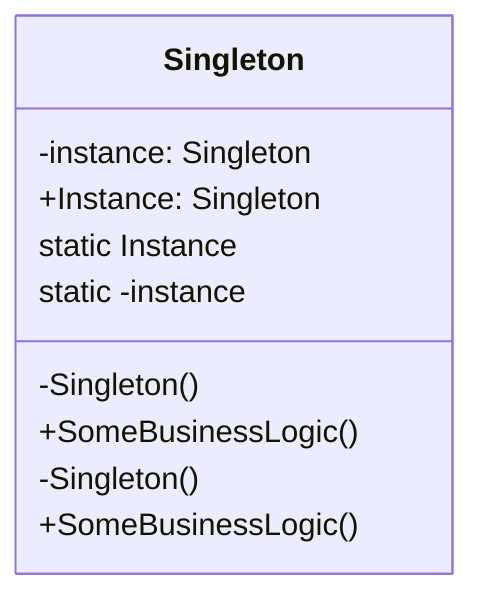

# Singleton

Singleton is a creational design pattern that ensures a class has only one instance and provides a global point of access to it.

## Problem

Sometimes you need exactly one object to coordinate actions across the system (e.g., a configuration manager, logger, or connection pool). Direct instantiation with `new` would allow multiple instances, which can lead to inconsistent state or resource conflicts.

## Description

The Singleton pattern restricts the instantiation of a class to a single object. It provides a static method or property to access that instance. The constructor is made private to prevent direct instantiation.

### Core Class Diagram



## Example (C#)

```csharp
public class Singleton
{
    private static Singleton instance;
    private static readonly object lockObj = new object();
    private Singleton() { }
    public static Singleton Instance
    {
        get
        {
            lock (lockObj)
            {
                if (instance == null)
                    instance = new Singleton();
                return instance;
            }
        }
    }
    public void SomeBusinessLogic()
    {
        // ...
    }
}
```

## When to Use
- When exactly one instance of a class is needed
- When global access to the instance is required

## Pros
- Controlled access to sole instance
- Reduced memory footprint

## Cons
- Can hide dependencies
- Makes unit testing harder
- Can introduce global state
