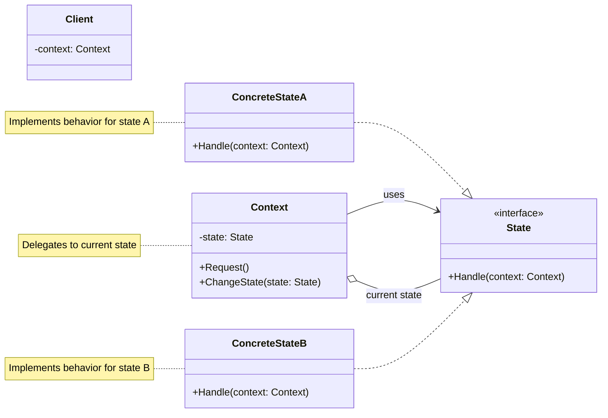

# State

Behavioral pattern - allows an object to alter its behavior when its internal state changes, appearing to change its class

## Problem

An object's behavior depends on its state, and it must change its behavior at runtime based on state transitions. For example:

- **Document editor**: Document can be in states like Draft, Review, Published with different behaviors for each
- **Order processing**: Order moves through states like Pending, Paid, Shipped, Delivered
- **Player controller**: Media player has states like Playing, Paused, Stopped with different button behaviors

Problems this solves:
- Complex conditional logic (if/switch statements) based on state
- Difficulty adding new states or changing state transitions
- State-dependent behavior scattered across the class
- Violation of Open/Closed Principle when modifying state behavior

## Description

The State pattern encapsulates state-specific behavior into separate classes and delegates state-dependent behavior to the current state object. The context object maintains a reference to the current state and delegates calls to it.

### Key Roles:
- **Context**: Maintains an instance of a ConcreteState subclass, defines interface for client
- **State**: Interface or abstract class that defines behavior for each state
- **ConcreteState**: Implements behavior associated with a specific state

### Core Class Diagram



## Real-World Example

### Media Player with State Pattern

```csharp
// Context class
class MediaPlayer
{
    private State _state;
    
    public MediaPlayer()
    {
        _state = new StoppedState();  // Initial state
    }
    
    public State State
    {
        set => _state = value;
        get => _state;
    }
    
    public void Play()
    {
        _state.Play(this);
    }
    
    public void Pause()
    {
        _state.Pause(this);
    }
    
    public void Stop()
    {
        _state.Stop(this);
    }
    
    public override string ToString() => $"Player is {_state}";
}

// State interface
interface State
{
    void Play(MediaPlayer context);
    void Pause(MediaPlayer context);
    void Stop(MediaPlayer context);
}

// ConcreteState: Stopped
class StoppedState : State
{
    public void Play(MediaPlayer context)
    {
        Console.WriteLine("Starting playback");
        context.State = new PlayingState();
    }
    
    public void Pause(MediaPlayer context)
    {
        Console.WriteLine("Cannot pause: player is stopped");
    }
    
    public void Stop(MediaPlayer context)
    {
        Console.WriteLine("Already stopped");
    }
    
    public override string ToString() => "stopped";
}

// ConcreteState: Playing
class PlayingState : State
{
    public void Play(MediaPlayer context)
    {
        Console.WriteLine("Already playing");
    }
    
    public void Pause(MediaPlayer context)
    {
        Console.WriteLine("Pausing playback");
        context.State = new PausedState();
    }
    
    public void Stop(MediaPlayer context)
    {
        Console.WriteLine("Stopping playback");
        context.State = new StoppedState();
    }
    
    public override string ToString() => "playing";
}

// ConcreteState: Paused
class PausedState : State
{
    public void Play(MediaPlayer context)
    {
        Console.WriteLine("Resuming playback");
        context.State = new PlayingState();
    }
    
    public void Pause(MediaPlayer context)
    {
        Console.WriteLine("Already paused");
    }
    
    public void Stop(MediaPlayer context)
    {
        Console.WriteLine("Stopping playback");
        context.State = new StoppedState();
    }
    
    public override string ToString() => "paused";
}

// Usage
var player = new MediaPlayer();
player.Play();   // Starting playback (transitions to Playing)
player.Pause();  // Pausing playback (transitions to Paused)
player.Play();   // Resuming playback (transitions to Playing)
player.Stop();   // Stopping playback (transitions to Stopped)
```

### Order Processing Example

```csharp
class Order
{
    private State _state;
    
    public Order()
    {
        _state = new PendingState();
    }
    
    public decimal Amount { get; set; }
    
    public void ChangeState(State state) => _state = state;
    
    public void Pay()
    {
        _state.Pay(this);
    }
    
    public void Ship()
    {
        _state.Ship(this);
    }
    
    public override string ToString() => $"Order is {_state}";
}

interface State
{
    void Pay(Order order);
    void Ship(Order order);
}

class PendingState : State
{
    public void Pay(Order order)
    {
        Console.WriteLine("Payment received");
        order.ChangeState(new PaidState());
    }
    
    public void Ship(Order order)
    {
        Console.WriteLine("Cannot ship: payment pending");
    }
    
    public override string ToString() => "pending";
}

class PaidState : State
{
    public void Pay(Order order)
    {
        Console.WriteLine("Already paid");
    }
    
    public void Ship(Order order)
    {
        Console.WriteLine("Order shipped");
        order.ChangeState(new ShippedState());
    }
    
    public override string ToString() => "paid";
}

class ShippedState : State
{
    public void Pay(Order order)
    {
        Console.WriteLine("Already paid");
    }
    
    public void Ship(Order order)
    {
        Console.WriteLine("Already shipped");
    }
    
    public override string ToString() => "shipped";
}
```

## When to Use

- Object behavior changes based on its state
- Runtime state transitions are needed
- Complex conditional logic based on state can be avoided
- State-dependent code is scattered across the class
- Need to add new states without modifying existing code
- State transitions should be explicit and maintainable

## Benefits

- **Encapsulates state behavior**: Each state's behavior is in its own class
- **Eliminates large conditionals**: Replaces if/switch statements with polymorphism
- **Open/Closed Principle**: New states can be added without modifying existing code
- **Single Responsibility Principle**: Each state class has one responsibility
- **Explicit state transitions**: State changes are clear and visible
- **Easier to test**: Each state can be tested independently

## Drawbacks

- Added complexity - introduces multiple classes for states
- Overkill for simple state machines with few states
- State transitions must be handled explicitly in each state class
- Can lead to many small classes if not managed carefully

## Related Patterns

- **Strategy**: State pattern is similar but focuses on state-dependent behavior while Strategy focuses on interchangeable algorithms
- **Singleton**: Often states are implemented as singletons since they're stateless
- **Factory**: Factory methods can create and return appropriate state objects
- **Composite**: States can be composed of other states for hierarchical state machines

## References

- [Microsoft Docs - State Pattern](https://learn.microsoft.com/en-us/dotnet/standard/design-patterns/state-pattern)
- [Refactoring.Guru - State](https://refactoring.guru/design-patterns/state)
- [Design Patterns: Elements of Reusable Object-Oriented Software by Gang of Four](https://en.wikipedia.org/wiki/Design_Patterns)
