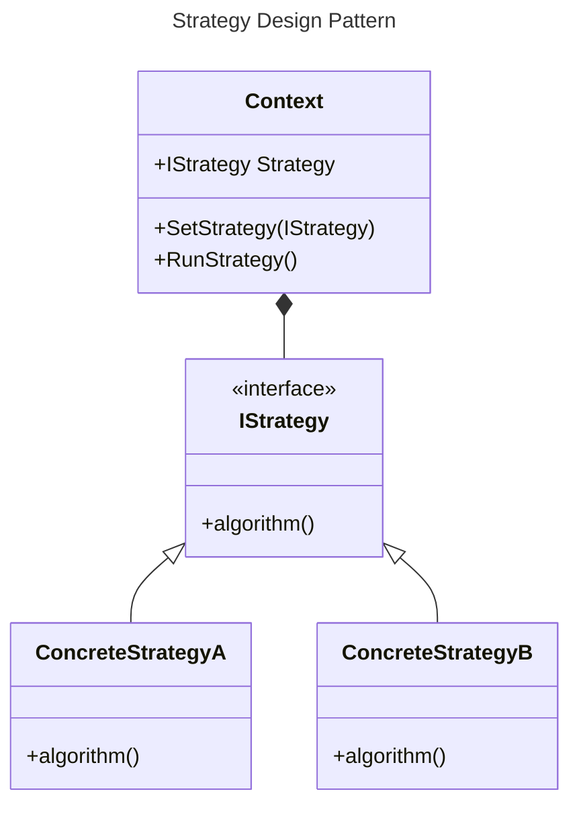

**Table of Content:**

* [1. Documentation](#1-documentation)
* [2. Problem](#2-problem)
* [3. Solution](#3-solution)
* [4. Diagram](#4-diagram)
* [5. Applicability](#5-applicability)
* [6. Pros and Cons](#6-pros-and-cons)
* [7. Example](#7-example)

# 1. Documentation

The Strategy Design Pattern is a behavioral design pattern that defines a family of algorithms, encapsulates each one of them, and makes them interchangeable. It allows a client to choose the appropriate algorithm to use at runtime, without altering its structure. This pattern promotes the "Open/Closed Principle" (one of the SOLID principles of object-oriented design), which states that classes should be open for extension but closed for modification.

The Strategy Design Pattern is like having different tools in a toolbox. You have a main tool (the "context") that needs to do a job, but you want to be able to swap out the specific tool it uses without changing the main tool itself.

This pattern is handy when you want to be able to use different methods to do the same task without messing with the main part of your program

"Using Composition rather than Inheritance"

Usefull links:
* YouTube video: [klik!](https://www.youtube.com/watch?v=v9ejT8FO-7I&list=PLrhzvIcii6GNjpARdnO4ueTUAVR9eMBpc)
* Refactoring Guru: [klik!](https://refactoring.guru/design-patterns/strategy)

# 2. Problem

# 3. Solution

# 4. Diagram

# 5. Applicability

# 6. Pros and Cons

# 7. Example

